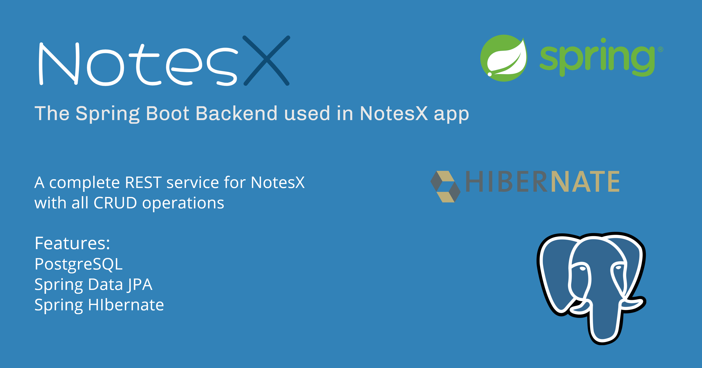

# **NotesX Backend** 

This is the Spring Boot backend code for notesX app.

## Setup
Clone the repository on your machine. Open the project on your IDE and connect it to your database and its done.
You can get the Android app code from https://github.com/Vaibhav2002/NotesX

## About

 It is built using Spring Boot, using PostgreSQL as its database. It also uses Spring Data JPA and Spring Hibernate in it.

- Fully functionable REST API. 
- Supports all CRUD operations

## Built With 🛠
- [Spring Boot](https://spring.io/projects/spring-boot) - Spring Boot is the top of the line Java backend framework
- [Spring Data JPA](https://spring.io/projects/spring-data-jpa) - Spring module for data handling
- [Spring Hibernate](https://hibernate.org) - ORM for Spring framework
- [PostgreSQL](https://www.postgresql.org) - PostgreSQL is a powerful, open source object-relational database

# Package Structure
    
    com.vaibhav.notes       # Root Package
    .
    ├── models              # Model data classes
    |
    ├── controller          # All RestController Classes           
    |
    ├── service             # Service Layer which links controller to repository
    |   
    ├── repository          # Repository layer which handles all data management
    |
    ├── exceptions          # Custom exception classes   
    |   
    └── utils               # Utility Classes

## Architecture
This app uses [***MVC (Model View Controller)***](https://terasolunaorg.github.io/guideline/1.0.1.RELEASE/en/Overview/SpringMVCOverview.html#:~:text=Spring%20Reference%20Document.,the%20development%20of%20web%20applications.) architecture.

 ## Contact
If you need any help, you can connect with me.

Visit:- [VaibhavJaiswal.io](https://vaibhav2002.github.io)
  

